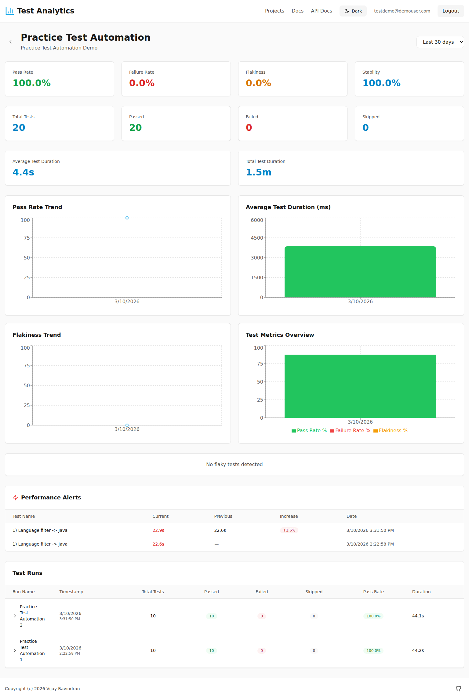

# Playwright Practice Table Automation

This project contains Playwright UI automation tests for the Practice Table page.

## Application Under Test

- Practice Table URL: https://practicetestautomation.com/practice-test-table/

## Prerequisites

- Node.js 18+ (Node.js 20+ recommended)
- npm

## Project Setup

1. Install dependencies:

```bash
npm install
```

2. Install Playwright browsers:

```bash
npx playwright install
```

3. (Optional) Configure Test Analytics API key used by `test-analytics-reporter`:

```bash
export API_KEY="your_api_key_here"
```

## Run Tests

- Run all tests (default):

```bash
npm test
```

- Run in parallel (10 workers):

```bash
npm run test:parallel
```

- Run sequentially (single worker):

```bash
npm run test:sequential
```

## View HTML Report

After test execution:

```bash
npx playwright show-report
```

## Generate Summary Report

Generate a standalone `summary.html` that visualizes:

- Pass/Fail trend over historical runs
- Parallel vs Sequential execution performance comparison

Run with the default history file (`history/test-history.json`):

```bash
npm run report:generate
```

Use a custom history input file:

```bash
npm run report:generate -- --input path/to/history.json
```

Write output to a custom location:

```bash
npm run report:generate -- --output reports/summary.html
```

Or set the history file via environment variable:

```bash
REPORT_HISTORY_FILE=path/to/history.json npm run report:generate
```

## Test Analytics Access

- URL: https://vijayravindran90.github.io/Test-analytics/
- Username: testdemo@demouser.com
- Password: Test@2129

After login, select the project named **Practice Test Automation** from the projects list to open the dashboard used by this repo.

## Repo Dashboard Snapshot



## Notes

- Playwright config: `playwright.config.ts`
- Tests: `tests/example.spec.ts`
- Page Object Model: `pages/practiceTablePage.ts`